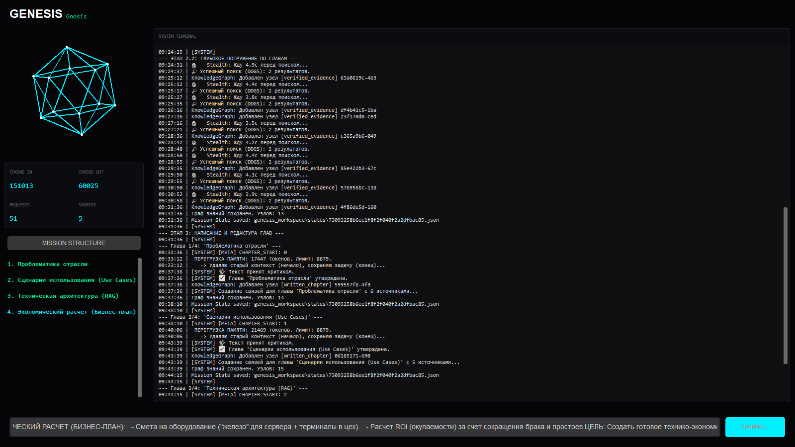
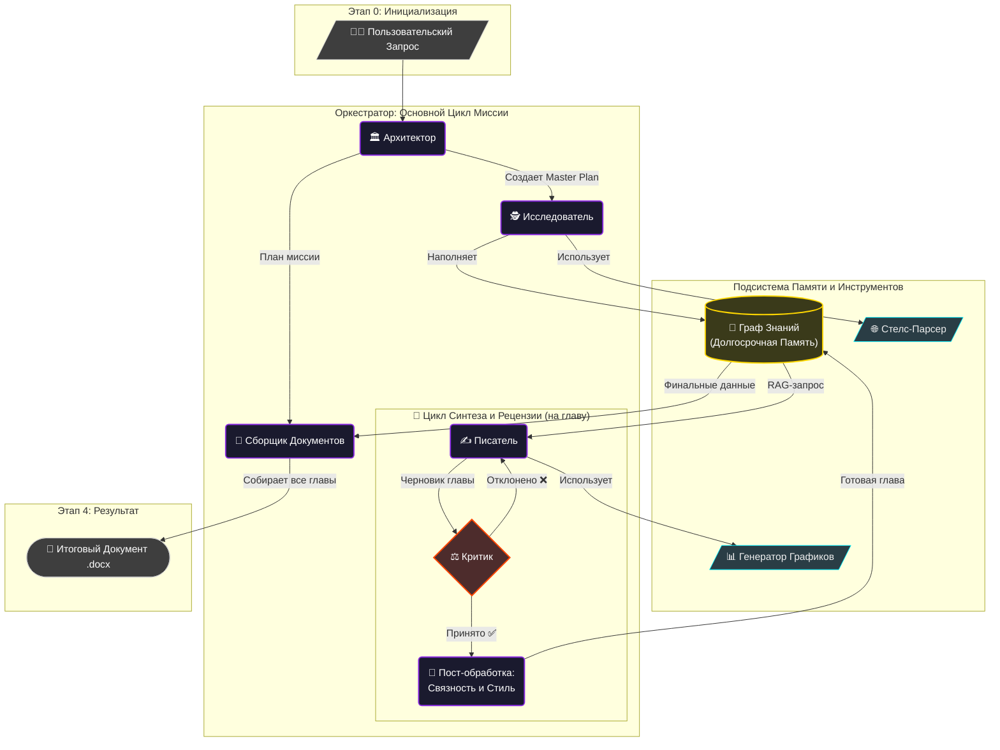

# Genesis-Gnosis: Автономная Когнитивная Архитектура 🧬

[](https://www.python.org/downloads/)
[](https://arxiv.org/abs/2308.08155)
[](https://arxiv.org/abs/2304.14814)
[](https://en.wikipedia.org/wiki/Persistence_(computer_science))
[](https://customtkinter.com/)
[](LICENSE)

**Genesis-Gnosis** — это автономная мульти-агентная система, спроектированная для выполнения комплексных исследовательских задач и синтеза структурированных аналитических документов. Она эмулирует когнитивный рабочий процесс эксперта: от декомпозиции задачи и сбора данных до написания, рецензирования и финальной стилизации текста.

Система решает фундаментальные проблемы современных LLM — ограниченность контекстного окна, склонность к галлюцинациям и отсутствие долгосрочной памяти — путем внедрения **гибридной модели памяти (Graph RAG)**, **adversarial-цикла верификации** и **отказоустойчивой архитектуры**, способной возобновлять работу после сбоев.

<br>

## 🚀 Ключевые Особенности

*   **🧠 Гибридная Память:** Сочетание краткосрочной контекстной памяти и долгосрочного графа знаний (NetworkX) для глубокого понимания связей между фактами.
*   **🤖 Рой Специализированных Агентов:** 7+ агентов, каждый с уникальной ролью (Архитектор, Исследователь, Писатель, Критик), работающих в оркестрованной последовательности.
*   **🛡️ Adversarial-дизайн:** Встроенный агент-Критик, который рецензирует каждую главу, запуская циклы доработки до тех пор, пока качество не будет соответствовать заданным стандартам.
*   **🌐 Стелс-парсер:** Интеллектуальный веб-краулер с ротацией User-Agent'ов и эвристической очисткой DOM для обхода защит и извлечения чистого контента.
*   **🔄 Отказоустойчивость:** Сохранение состояния миссии (State Serialization) после каждого ключевого этапа, что позволяет возобновить многочасовую работу с точки прерывания.
*   **📊 Динамическая Визуализация:** Встроенный Code Interpreter, который анализирует текст, пишет Python-код для генерации графиков (Matplotlib/Seaborn) и вставляет их в итоговый документ.
*   **📡 Удаленный Мониторинг:** Асинхронный мост в Telegram для отслеживания прогресса и получения итоговых артефактов на любом устройстве.

<br>

## 🖥️ Mission Control Center: Тактический Дашборд

Управление системой осуществляется через интерактивный дашборд, предоставляющий полный контроль и визуализацию "мыслительного процесса" роя агентов.

*(**Рекомендация:** Замените это изображение на GIF-анимацию работы интерфейса)*


*   **HyperCortex Visualizer:** 3D-проекция когнитивной активности в виде вращающегося икосаэдра, который меняет цвет и динамику в зависимости от активного агента (Планирование, Исследование, Генерация, Критика).
*   **Live Thought Stream:** Терминал, отображающий "поток сознания" (Chain-of-Thought) системы в реальном времени, включая решения, найденные источники и вердикты Критика.
*   **Mission Telemetry:** Панель мониторинга ключевых метрик: использованные токены (вход/выход), количество API-запросов и число проанализированных источников.
*   **Dynamic Mission Structure:** Иерархический список глав, который обновляется в реальном времени, подсвечивая текущую, завершенные и будущие задачи.

<br>

## 🗺️ Архитектура Рабочего Процесса

Система работает как конечный автомат (Finite State Machine), где каждый переход — это завершенный этап работы одного из агентов.



<br>

## 🏗️ Архитектурный Deep-Dive

Проект построен на принципах модульности и отказоустойчивости, реализуя паттерн **Orchestrator-Workers**.

### 1. Оркестратор (`GenesisSystem`)
Ядро системы, управляющее жизненным циклом миссии.
*   **Finite State Machine (FSM):** Четко определяет последовательность этапов (`init`, `plan_approved`, `research_done`, `writing_in_progress`, `done`).
*   **State Serialization:** Перед каждым критическим шагом (например, перед началом написания главы) состояние всей миссии (план, написанные части, контекст) сериализуется в JSON. В случае сбоя, система загружает последнее известное состояние и продолжает работу.

### 2. Когнитивное Ядро (`LLMEngine`)
Высоконадежная обертка над OpenAI-совместимым API.
*   **Adaptive JSON Repair:** Трехуровневая система восстановления структуры данных, если LLM возвращает некорректный JSON.
    1.  *Уровень 1 (Regex):* Поиск и извлечение JSON-блоков из "грязного" текста.
    2.  *Уровень 2 (Heuristics):* Автоматическое добавление недостающих скобок и кавычек.
    3.  *Уровень 3 (Fallback Parser):* Если JSON невосстановим, система переключается на парсинг простого текста, спасая сгенерированную идею.
*   **Smart Context Trimming:** Динамически обрезает историю диалога, сохраняя недавние события и сжимая старые, чтобы всегда оставаться в пределах контекстного окна модели.
*   **Thought Isolation:** Алгоритм, который отделяет "мысли" модели (логику рассуждений в тегах `<think>`) от финального ответа, обеспечивая чистоту логов и данных.

### 3. Подсистема Памяти (Hybrid Memory)
В отличие от стандартных RAG-систем на векторных базах, Genesis-Gnosis использует гибридный подход для более глубокого контекстного понимания.
*   **Short-Term Memory:** "Рабочая память" в виде скользящего окна с саммари предыдущих глав.
*   **Long-Term Memory (Knowledge Graph):** Граф на базе **NetworkX**, где:
    *   **Узлы (Nodes)** — это типизированные сущности: `Fact`, `Source`, `WrittenChapter`.
    *   **Ребра (Edges)** — это семантические связи, например, `[Глава 5] -> cites_source -> [Источник_URL]`.
    *   Такая структура позволяет выполнять сложные запросы, недоступные векторным базам, например: "На какие источники ссылалась глава, в которой впервые упоминался термин X?".

### 4. Инструментарий (`GenesisToolbox`)
Набор высокоуровневых инструментов, доступных агентам.
*   **Stealth Web Surfer:** Кастомный краулер с защитой от fingerprinting. Использует ротацию `User-Agent` и `Referer`, эвристическую очистку DOM через `BeautifulSoup4` и каскадный поиск (DDGS -> Wikipedia API).
*   **Document Forge:** Движок рендеринга финальных артефактов (`.docx`). Преобразует Markdown в стилизованный документ с поддержкой таблиц, кода, цитат и автоматической генерацией библиографии по ГОСТ.

<br>

## 🤖 Протоколы Роя Агентов (Agent Swarm)

Каждый агент — это специализированный воркер с жестко заданным промпт-протоколом.

| Агент | Роль | Задача и Методология |
| :--- | :--- | :--- |
| 🏛️ **The Architect** | Стратегический Планировщик | **Мантра:** "От хаоса к структуре". <br> **Метод:** Проводит "когнитивное сканирование" темы, выявляя ключевые вопросы и противоречия. Декомпозирует абстрактную задачу в детализированный `ArticleMasterPlan` (Pydantic-модель). Умеет переключаться между режимами `GENERATE` (создание с нуля) и `EXTRACT` (парсинг плана из запроса пользователя). |
| 🕵️ **The Researcher**| Специалист по OSINT | **Мантра:** "Только верифицированные факты". <br> **Метод:** Для каждой главы плана генерирует точечные "снайперские" запросы для поиска доказательств. Использует протокол `EVIDENCE_DISTILLER` для извлечения сухих фактов, цифр и цитат из веб-страниц, отфильтровывая "воду". Наполняет Граф Знаний. |
| ✍️ **The Writer**| Синтезатор Нарратива | **Мантра:** "Превратить данные в историю". <br> **Метод:** Перед написанием главы выполняет RAG-запрос к Графу Знаний. Если в полученных фактах много числовых данных, активирует **внутренний Code Interpreter**: пишет Python-скрипт (Matplotlib/Seaborn), исполняет его и вставляет сгенерированный график в текст. |
| ⚖️ **The Critic** | Adversarial-Рецензент | **Мантра:** "Качество превыше всего". <br> **Метод:** Работает в цикле `while not approved`. Анализирует текст на логические ошибки, слабость аргументации и соответствие ТЗ. Возвращает структурированный фидбек `ReviewFeedback` (Pydantic-модель) с конкретными правками для Писателя. |
| 🌉 **Continuity Director**| Режиссер Повествования | **Мантра:** "Бесшовный нарратив". <br> **Метод:** Читает последний абзац предыдущей главы и первый абзац текущей. Генерирует "смысловой мост" — переходный параграф, который логически связывает две части, создавая единое повествование. |
| 👻 **Style Polymath**| Стилист и "Призрак" | **Мантра:** "От машины к человеку". <br> **Метод:** Финальный слой обработки. Анализирует текст на паттерны, свойственные ИИ (повторяющиеся конструкции, отсутствие идиом), и переписывает его, добавляя синтаксическое разнообразие и более естественный, "авторский" стиль. |

<br>

## ⚙️ Установка и Конфигурация

Проект спроектирован для работы в **локальной, privacy-first среде**. При использовании локальных LLM ваши данные не покидают вашу машину.

### Требования
*   Python 3.10+
*   RAM: 6GB+ , 16GB+ (если локальная LLM запущена на той же машине, этого вполне достаточно для запуска 4B модели).

### 1. Установка
```bash
# Клонировать репозиторий
git clone https://github.com/your-username/genesis-gnosis.git
cd genesis-gnosis

# Установить зависимости
pip install -r requirements.txt
```

### 2. Подключение LLM
Система работает с любым OpenAI-совместимым API.
*   **Вариант А (Локально - Рекомендуется):**
    1.  Установите [LM Studio](https://lmstudio.ai/) или [Ollama](https://ollama.com/).
    2.  Загрузите производительную модель (например, `qwen3-4b-thinking-2507` или `gpt-oss-20b` ).
    3.  Запустите локальный сервер (обычно на порту `1234` или `11434`).
*   **Вариант Б (Облачные API):**
    *   Можно указать эндпоинт OpenAI, Groq, Together AI и т.д. (может потребоваться API-ключ).

### 3. Настройка (`config.py`)
Система поставляется с **оптимизированным конфигом под 16k контекста** (16384 токена). 
Откройте `config.py` и отредактируйте ключевые параметры:

```python
# 1. Подключение к LLM
LLM_BASE_URL = "http://localhost:1234/v1"  # Ваш локальный сервер (LM Studio/Ollama)
LLM_API_KEY = "lm-studio"                 # Заглушка для локальных, реальный ключ для OpenAI

# 2. Бюджет Памяти (ВАЖНО)
# Рассчитано на 16384 токена. Если ваша модель поддерживает 32k/128k - увеличивайте.
CONTEXT_WINDOW_SIZE = 16384   
MAX_OUTPUT_TOKENS = 4096      

# 3. Настройки Агентов
TARGET_CHAPTER_COUNT = 5      # Сколько глав писать
SEARCH_NUMBER = 2             # Глубина поиска (ссылок на запрос)
WRITER_EVIDENCE_CHUNK_SIZE = 15000 # Сколько символов фактов подавать Писателю

# 4. Телеграм-мост (оставьте пустым для отключения)
TG_BOT_TOKEN = ""
TG_CHAT_ID = ""
```

### 4. Запуск
```bash
python main.py 
```
Откроется GUI. Введите вашу задачу в поле ввода и нажмите "ENGAGE".

<br>

## 📂 Структура Рабочих Данных

При первом запуске система автоматически создаст необходимую иерархию папок:

*   `genesis_artifacts/` — **Здесь лежат готовые документы.** Сюда сохраняются финальные `.docx` файлы.
*   `genesis_logs/` — Технические логи системы (для отладки ошибок подключения и API).
*   `genesis_thoughts/` — "Черный ящик" сознания. Полные логи "мыслей" агентов (Chain-of-Thought), сырые ответы LLM и промежуточные решения.
*   `genesis_workspace/` — Временные файлы: сгенерированные Python-скрипты для графиков, кэш веб-страниц и состояния миссии (`.json`).

## 🛡️ Инженерные решения для Отказоустойчивости

Особое внимание уделено стабильности системы при длительной автономной работе:

1.  **Self-Debugging Code Generation:** Генератор графиков работает в цикле. Если сгенерированный Python-код падает с ошибкой, система "читает" traceback, передает его обратно в LLM вместе с ошибочным кодом и просит исправить ошибку.
2.  **Rate Limiter:** Встроенный ограничитель частоты запросов к веб-сайтам для предотвращения временных IP-банов.
3.  **Graceful Degradation:** Если основная ("умная") модель недоступна, система может автоматически переключиться на более простую ("быструю") модель для выполнения рутинных задач, таких как форматирование или простое извлечение.
4.  **Persistent State:** Состояние миссии переживает перезапуск скрипта. Если процесс был прерван, при следующем запуске с тем же запросом система предложит продолжить с прерванной главы.

---

## ⚠️ Правовая Оговорка и Условия Использования (Disclaimer)

Используя данное программное обеспечение (далее — «Система»), вы подтверждаете, что прочитали, поняли и полностью принимаете следующие условия:

### 1. Статус Проекта и Отсутствие Гарантий

Система является **исследовательской разработкой** и демонстрацией концепции (Proof-of-Concept) в области автономных агентных систем (Agentic Workflows). Она предоставляется на условиях **«КАК ЕСТЬ» (AS IS)**, без каких-либо явных или подразумеваемых гарантий, включая, но не ограничиваясь, гарантиями коммерческой пригодности, пригодности для определенной цели и отсутствия нарушений прав третьих лиц.

Автор не гарантирует, что работа Системы будет бесперебойной, безошибочной или что все дефекты будут исправлены. Система может вести себя непредсказуемым образом, выдавать неверные результаты или прекращать работу в любой момент.

### 2. Ответственность за Сгенерированный Контент

Автор **не несет никакой ответственности** за тексты, данные, выводы, изображения и любые другие материалы, созданные с помощью Больших Языковых Моделей (LLM) через эту Систему. Контент, сгенерированный ИИ, может содержать:
*   **Фактические неточности** и откровенные выдумки («галлюцинации»).
*   **Предвзятость**, стереотипы и социально неприемлемые суждения, унаследованные из обучающих данных.
*   **Устаревшую или нерелевантную информацию**.
*   **Нарушения авторских прав** или плагиат.

**Вся ответственность за проверку, верификацию, редактирование и использование сгенерированного контента лежит исключительно на конечном пользователе.**

### 3. Использование Веб-Скрейпинга и Данных

Модуль сбора данных (веб-скрейпер) предназначен для автоматизации получения информации из **общедоступных источников**. Пользователь, инициирующий работу этого модуля, несет полную ответственность за:
*   **Соблюдение файла `robots.txt`** и Условий предоставления услуг (Terms of Service) целевых веб-сайтов.
*   **Уважение авторских прав** и прав на интеллектуальную собственность. Любые собранные данные должны использоваться в соответствии с применимым законодательством (например, принципы добросовестного использования / Fair Use).
*   **Предотвращение чрезмерной нагрузки** на веб-серверы. Система имеет встроенные ограничители, но их неправильная настройка может привести к блокировке вашего IP-адреса.

Автор не одобряет и не несет ответственности за любое неэтичное, вредоносное или незаконное использование функций сбора данных.

### 4. Ваша Ответственность

1.  Вы используете данное программное обеспечение **на свой страх и риск**.
2.  Вы несете полную ответственность за **соблюдение законодательства** вашей страны при работе с Системой.
3.  Вы обязаны **критически оценивать все результаты** работы Системы перед их публикацией, использованием в принятии решений или интеграцией в другие проекты.
4.  Автор не несет ответственности за любой прямой, косвенный, случайный или последующий ущерб (включая потерю данных, упущенную выгоду или сбои в работе), возникший в результате использования или невозможности использования данной Системы.

---

## 👨‍💻 Автор

**IImasterII**

*Full-Stack Python Developer | AI Engineer*
